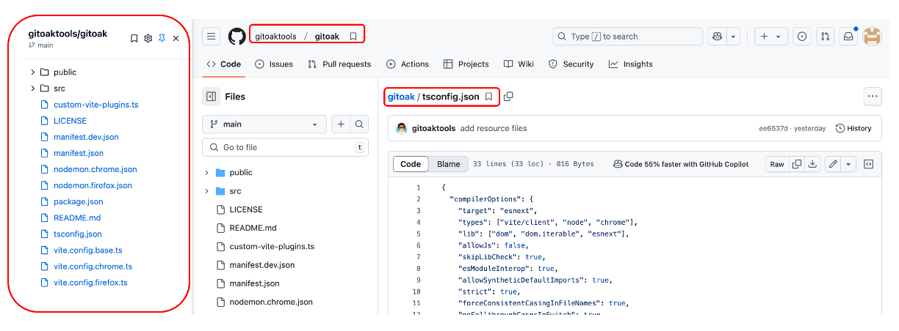
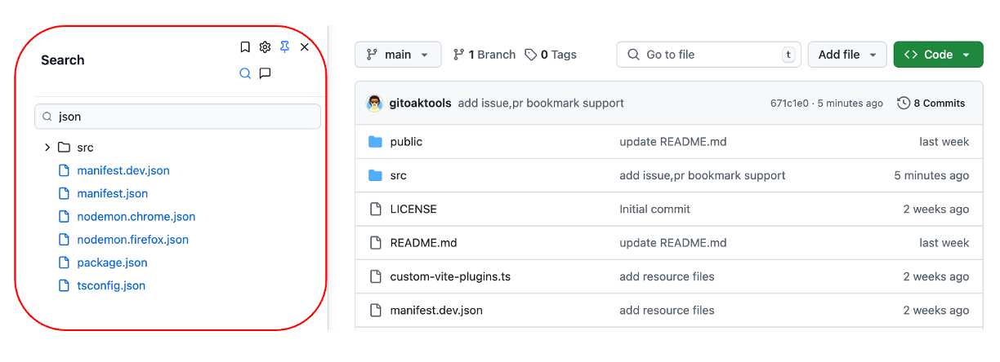
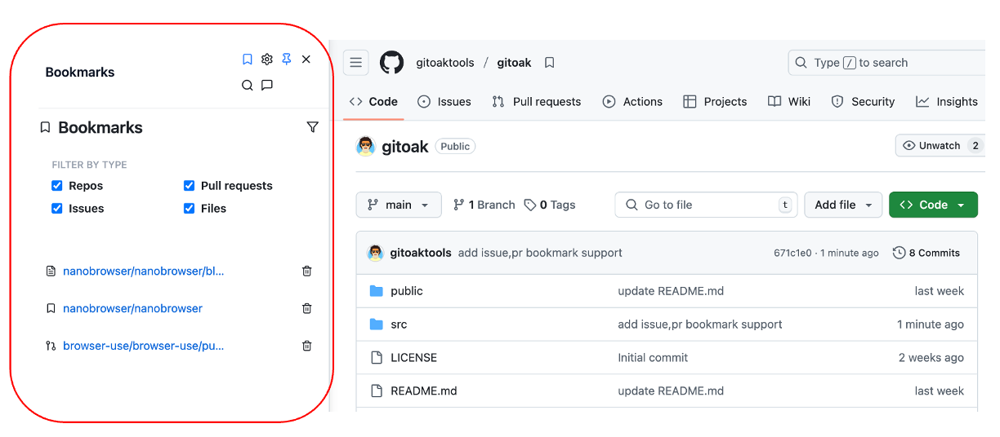
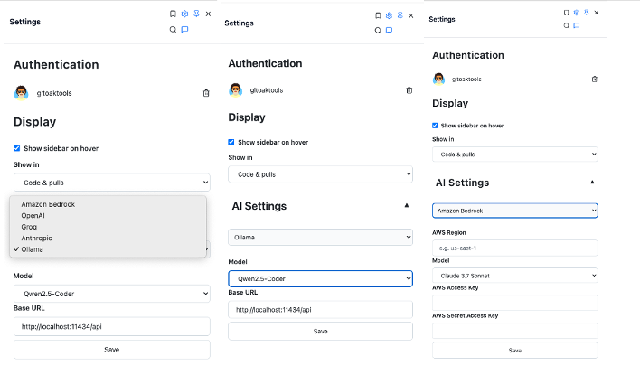
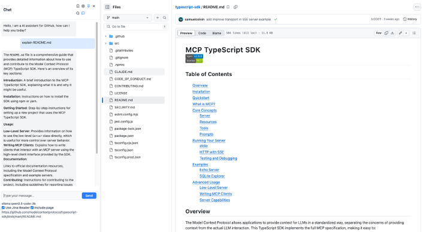
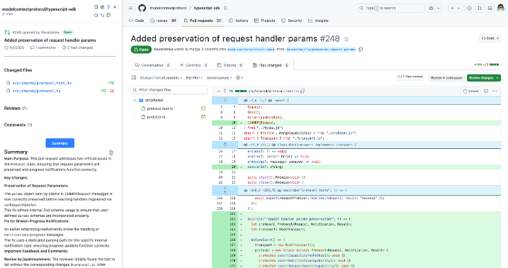
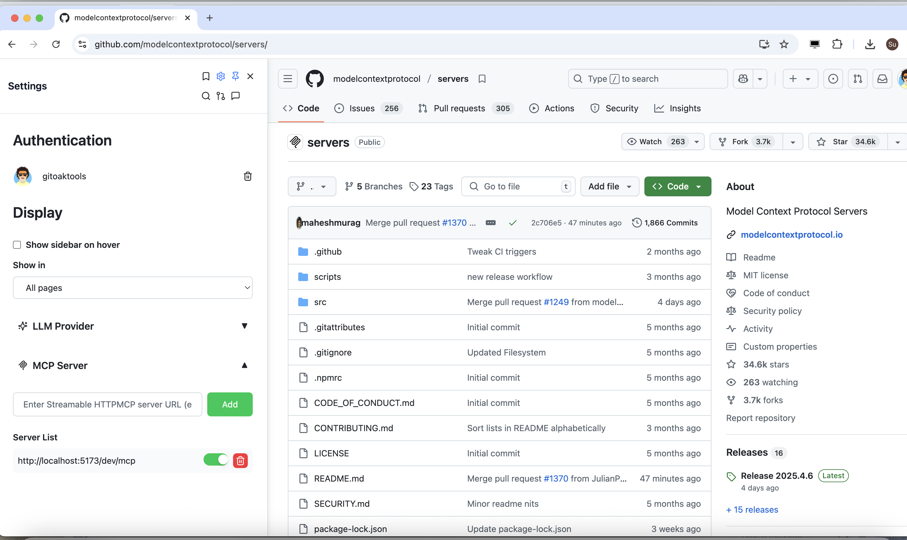

# Gitoak
**Gitoak** is a free file tree extension for GitHub, available on Chrome, Firefox and Edge.

## Introduction
**Gitoak** was developed with the vision of enhancing GitHub repository navigation by seamlessly integrating AI capabilities with the traditional file tree experience. Inspired by popular extensions like Octotree, Gitako, and Span-tree, GitOak takes the file navigation experience to the next level by incorporating AI-powered features.

The main motivation behind **Gitoak** is to bridge the gap between conventional GitHub repository browsing and modern AI assistance. While existing solutions like Octotree provide excellent file tree navigation, GitOak aims to enhance this experience by leveraging AI to help developers better understand, navigate, and interact with code repositories.

gitoak  is a free file tree extension for GitHub, available on Chrome, Firefox and Edge.


Gitoak UI Demo:



Search:



Bookmarks



AI Chat:





Pull Request:



Streamable HTTP MCP Server support:



### Update log:

 20250411:  Streamable HTTP MCP Server supported.

 20250408:  Add pull request quick summary.

 20250402:  Add AI chat support, all configs are stored in Chrome localStorage 'aiSettings'".

 20250322:  Add issue,pull request bookmark support, add bookmark filter.

 20250312:  Add bookmark, only support localstoarge.

 20250311:  Update source code.


### How to use gitoak?

1. Install the extension from the Chrome Web Store. (Coming soon)
2. Clone GitHub repository and build it by yourself.
    2.1 Build the project
    ```bash
    git clone https://github.com/gitoaktools/gitoak.git
    cd gitoak
    pnpm install
    pnpm run build 
    ```
    2.2 Load the extension to chrome
    * Open chrome use `chrome://extensions/`
    * Click `Load unpacked` and select the `dist_chrome` folder.
    * Open a GitHub repository page and you will see the GitOak sidebar.
    


### How about security ?

1. This is an open-source project, so you can check all the source code.
2. OAuth tokens or personal access tokens are only stored in Chrome's localStorage, as GitHub requires token authentication for API access.
3. All AI settings are stored in Chrome's localStorage as well.


### Roadmap 🚀

#### Phase 1: Core Implementation
- [x] Develop basic file tree functionality
- [x] Implement GitHub repository navigation
- [x] Create browser extension infrastructure
- [ ] Support for Chrome, Firefox, and Edge browsers

#### Phase 2: AI Integration with Vercel SDK
- [x] Integrate Vercel AI SDK
- [ ] Implement code summarization features
- [ ] Add repository overview generation

#### Phase 3: Advanced AI Features
- [ ] Code review assistance
- [ ] Documentation generation
- [ ] Dependency analysis
- [ ] Code quality suggestions

#### Phase 4: Enhanced User Experience
- [ ] Data synchronization across devices
- [ ] Smart bookmarking system
  - [x] bookmark with localstorage
  - [ ] bookmark with backend storage sync all device

- [ ] Repository exploration features
- [ ] Personalized navigation history


> Note: This roadmap is subject to change based on user feedback and community needs.   

### Inspired By 💡
- [Octotree](https://github.com/ovity/octotree) 
- [Gitako](https://github.com/EnixCoda/Gitako) 
- [Span Tree](https://github.com/tavyandy97/span-tree) 
